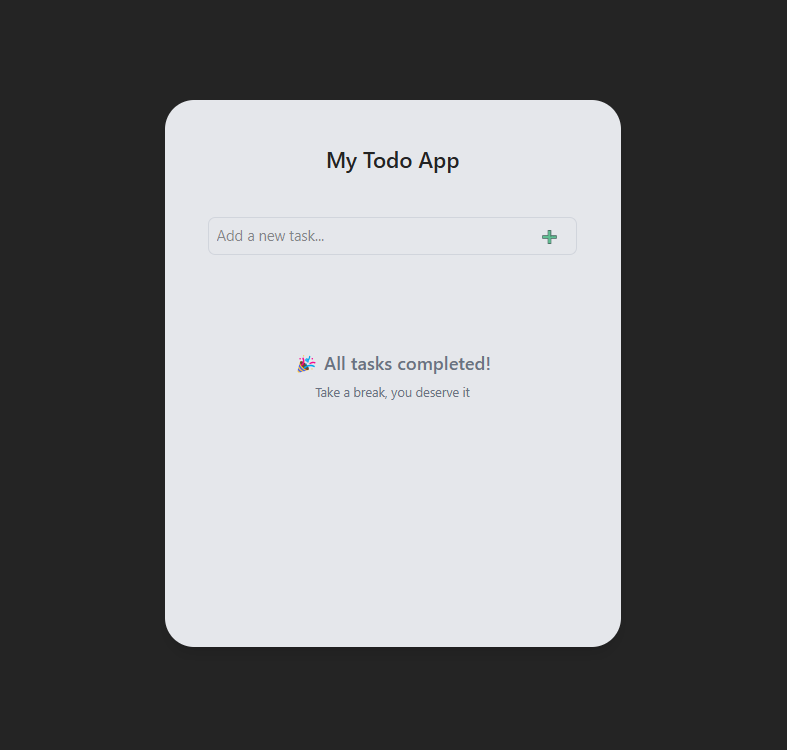

# My Todo App 📝

**My Todo App** is a simple and intuitive task management tool built with [Svelte 5](https://svelte.dev), powered by a local JSON-based API using `json-server`. It supports adding, editing, completing, and deleting tasks with a sleek, responsive UI styled using Tailwind CSS.



---

## 🛠 Built With

-   [Svelte 5](https://svelte.dev/)
-   [Tailwind CSS](https://tailwindcss.com/)
-   **JSON Server**

---

## 🚀 Getting Started

1. **Clone the repository:**

    ```sh
    git clone git@github.com:HeidiDragomir/todo-app-svelte.git
    ```

2. **Navigate to the project folder:**

    ```sh
    cd todo-app-svelte
    ```

3. **Install dependencies:**

    ```sh
    npm install
    ```

4. **Start the dev server (Svelte + JSON Server)**

    ```sh
    npm run dev
    ```

5. **Open in browser:**

    Visit [http://localhost:5173](http://localhost:5173) to view the app.

    API: [http://localhost:3000/tasks](http://localhost:3000/tasks)

---
